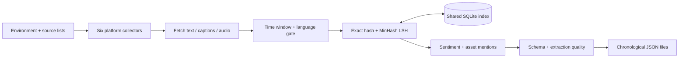

# Social Media Intelligence Pipeline

[](https://github.com/ashkanchaji/social_media_scraping/actions/workflows/ci.yml)

A Python pipeline that collects financial and energy-market coverage from **six social platforms** and converts it into consistent, analysis-ready JSON records. Shared utilities handle multilingual text, financial asset mentions, sentiment, duplicate detection, and record quality.

The project demonstrates API integration, resilient collection, local NLP inference, audio transcription, and persistent cross-platform deduplication. An offline demo makes the shared pipeline easy to inspect without platform accounts or model downloads.

## Try the offline demo

Use **Python 3.12 or 3.13**. A GPU is optional.

```bash
git clone https://github.com/ashkanchaji/social_media_scraping.git
cd social_media_scraping
python3 -m venv .venv
source .venv/bin/activate
python -m pip install -r requirements-core.txt
python demo.py
```

On Windows, activate with `.venv\Scripts\Activate.ps1` in PowerShell.

The demo processes three **synthetic** posts through the real shared utilities:

- An English X post and an identical Telegram post, linked by their duplicate group.
- A Persian Telegram post with `USDT` and gold (`XAU`) mentions.
- Chronological JSON output with source metadata, language, asset mentions, duplicate flags, and quality checks.

It prints JSON to stdout, uses a temporary SQLite database, and cleans up its temporary files. Sentiment and NLI models are explicitly disabled; their confidence fields remain `null`. Synthetic URLs illustrate the schema and do not identify fetched posts.

## Supported collectors

| Platform | Collection method | Configuration / credentials | Output directory |
|---|---|---|---|
| X / Twitter | Public syndication timelines; `x-tweet-fetcher` and DuckDuckGo fallbacks | Accounts or keywords; optional `XTF_NITTER` for timeline fallback | `twtr-tweets/` |
| YouTube | `yt-dlp` discovery, captions, optional local Whisper fallback | Channels or keywords | `yt-transcripts/` |
| Telegram | Telethon channel history, including refresh of edited messages | Public channels; `TELEGRAM_API_ID`, `TELEGRAM_API_HASH`, initial user login | `tel-transcripts/` |
| Reddit | Read-only PRAW Data API | Subreddits; `REDDIT_CLIENT_ID`, `REDDIT_CLIENT_SECRET` | `reddit-posts/` |
| TikTok | Account video listings, captions, optional Whisper fallback | Verified account usernames | `tiktok-videos/` |
| Truth Social | Mastodon-compatible account/status endpoints | Accounts; username/password or `TRUTHSOCIAL_TOKEN` | `truth-posts/` |

`SCRAPE_MODE=accounts` reads configured sources within the collection window. `SCRAPE_MODE=keyword` uses keyword discovery or filtering. Telegram always reads channel history. TikTok and Truth Social keyword mode filters configured accounts' timelines. X keyword mode prioritizes trusted accounts and applies configurable credibility thresholds to other authors.

## Architecture



**Shared infrastructure:** rotating logs, retry/backoff, rate limiting, environment parsing, and incremental file merges. X account collection distinguishes blocked requests from empty timelines, falls back immediately during cooldowns, and retries deferred accounts after the initial pass.

**Text analysis:** English sentiment uses FinBERT; other languages use a multilingual model. Asset tagging combines aliases/cashtags with optional NLI relevance scoring. Non-Latin text uses direct aliases without English NLI inference. Missing models produce `null` confidence rather than invented predictions.

**Deduplication:** Unicode-aware normalization and MD5 identify identical text; MinHash/LSH compares four-word shingles at a Jaccard threshold of `0.55`. SQLite persists the index between runs. X, Telegram, TikTok, and Truth Social retain duplicate flags; YouTube and Reddit currently skip records marked as duplicates. Similar text does not necessarily mean the same event.

**Quality:** platform-aware identity, URL, timestamp, extraction, engagement/media, asset, sentiment, and dedup checks contribute to a harmonic-mean score from 0–100. This score measures structural quality, not factual accuracy or model performance.

## Run live collection

Install collector dependencies from the repository root:

```bash
python -m pip install -r requirements.txt
cp .env.example .env
mkdir -p keywords sources
cp -n examples/keywords/*.txt keywords/
cp -n examples/sources/*.txt sources/
```

These copy commands target Linux/macOS. On Windows, copy the example folders using your file manager. Edit `.env` and the copied inputs before collecting. Telegram, TikTok, and Truth Social source templates deliberately contain no usernames: add verified sources yourself. The examples are starter configuration, separate from private monitoring lists.

Set credentials only in `.env` or your environment. Telegram's first run requires interactive phone/code login; later runs reuse the local session. Complete that login before using the unattended runner.

Run an individual collector:

```bash
X_SCRAPE_MODE=accounts python twtr-scraper.py
YT_SCRAPE_MODE=keyword python yt-scraper.py
python tel-scraper.py
python reddit-scraper.py
python tiktok-scraper.py
python truth-scraper.py
```

Environment prefixes are `X_`, `YT_`, `TEL_`, `RD_`, `TT_`, and `TS_`. A prefixed setting overrides its shared setting. Shell exports override `.env` for the **same variable name**. The example `.env` includes X/YouTube mode overrides; change those when switching modes.

Key settings are documented in [`.env.example`](.env.example):

| Setting | Purpose |
|---|---|
| `SCRAPE_MODE` | `keyword` or `accounts` |
| `MAX_PAST_MINUTES` | Collection window in minutes; `1440` means one day |
| `ALLOWED_LANGUAGES` | Comma-separated language codes; default `en,fa` |
| `LANGUAGE_MIN_CONFIDENCE` | Reject unsupported languages only when detection is confident |
| `SENTIMENT_MODEL` / `MULTILINGUAL_SENTIMENT_MODEL` | Language-specific sentiment models; `none` disables them |
| `ASSET_NLI_MODEL` | Three-class relevance model; `none` keeps direct aliases only |
| `WHISPER_TASK` | `translate` for English audio output or `transcribe` to retain the spoken language |

### Optional NLP and transcription

```bash
python -m pip install -r requirements-models.txt
```

Install **FFmpeg** on your system for audio fallback and make `ffmpeg` available on `PATH`. Model weights download on first use and can require substantial disk space and RAM. CPU inference is supported; compatible CUDA/cuDNN libraries are needed for GPU Whisper. Follow [faster-whisper's GPU setup](https://github.com/SYSTRAN/faster-whisper#gpu) for your machine.

Without the optional dependencies, collection can still use platform text/captions and direct asset aliases. Sentiment is `null`; semantic asset inference and Whisper audio fallback are unavailable. YouTube may translate non-English captions to English. Whisper defaults to `translate`; set `WHISPER_TASK=transcribe` to preserve spoken language. Sentiment analysis itself does not translate stored text.

### Unattended runs

On Linux, `bash run-scrapers.sh` runs all six collectors sequentially using `.venv/bin/python` when available. `flock` prevents overlapping runner instances. The runner continues after process failures and exits nonzero if any collector process fails; collectors can also log configuration/source errors and return normally, so inspect `logs/`.

For cron, use an absolute project path, create `logs/` before redirecting output, and keep the collection window larger than the schedule interval. Run duration depends on source count, pacing, models, and upstream limits.

## Record format

Each output file contains a JSON array sorted by publication time. Field capitalization is intentional and shared across collectors.

| Field | Contents |
|---|---|
| `record_id` | `<Platform>_<author_or_channel_id>_<native_id>` |
| `Source` | Platform, source/author identity, original URL |
| `Content` | Type, title, `raw_text`, empty downstream `Clean_text`, detected language |
| `time_stamps` | UTC `published_at`, `collected_at`, optional `updated_at` |
| `asset_mention` | Mention text, canonical asset, symbol, class, ID, optional confidence |
| `sentiment` | `positive`, `neutral`, or `negative` plus confidence; nullable |
| `Engagement` / `media` | Available interaction counts and attachment metadata |
| `deduplication` | Content hash, duplicate flag, group and original record IDs |
| `quality` | Completeness, failed checks, extraction errors, score |

Inspect the full format with `python demo.py`. Extend the built-in asset registry by copying [the registry template](assets-registry/asset-registry.example.json) to `assets-registry/asset-registry.json` and editing its entries.

## Repository layout

```text
*-scraper.py                    Six independent platform collectors
pipeline_utils.py               Configuration, analysis, scoring, output helpers
dedup_utils.py                  Persistent exact/near-duplicate detection
demo.py                         Offline synthetic pipeline demo
selfcheck_schema.py             Schema, config, Unicode, and routing checks
selfcheck_twtr_retry.py          Mocked X blocking/fallback/retry checks
run-scrapers.sh                 Sequential Linux runner with overlap lock
requirements*.txt               Core, collection, and optional model dependencies
examples/                       Public starter keywords and source templates
assets-registry/                Custom asset registry template
.github/workflows/ci.yml         Offline checks on Python 3.12 and 3.13
```

Private `.env` files, actual source/keyword lists, login sessions, collected records, logs, databases, PDF documentation, vendored dependencies, and local Graphify artifacts are excluded from version control.

## Validation and limits

```bash
python selfcheck_schema.py
python selfcheck_twtr_retry.py
python demo.py
bash -n run-scrapers.sh
```

CI runs these offline checks plus Python compilation. The checks validate shared behavior and mocked X failures; they do not establish live platform availability, transcription accuracy, or NLP accuracy.

Live coverage depends on platform permissions, source visibility, time windows, caps, search indexing, and rate limits. X syndication can be cached or incomplete; fallback discovery cannot guarantee full account history. Unofficial web endpoints can change. Configure conservative pacing, respect each platform's access requirements, and review collected text before downstream analysis.
